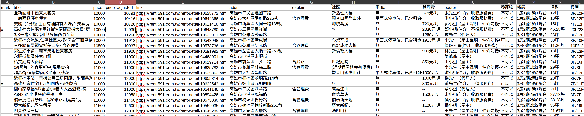

# 591 租房網自動抓取腳本

MIT LICENSE 開源，希望能幫助到有需要的人

## Changelog

### 2025-09-25

- 轉換成用 UV 管理 Python 環境
- 更新 scraping 配置
  - 物件列表爬取 (`collect_list.py`) 已經測試可用
  - 物件詳情 (`fecth_info.py`) **部分可用**，有一些數據欄位已經無法直接爬取

591 的防爬蟲機制已經大幅度升級，純 Selenium 解法似乎已經不可行。我已經儘量更新了程式碼，恢復仍可以爬取的欄位，其餘欄位 (如價格、地址) 目前在結果中會是空字串。

我可能短期內不會再對這個 repository 進行開發，如果有人知道如何用純 Selenium 繞過防爬蟲限制，歡迎提交 PR 或發個 Issue 告知我。

### 2021-12-17

- 針對 591 網站界面更新進行修改。感謝 [haruzheng 回報](https://github.com/ceshine/591scraper/issues/1)。
- 依據新版界面修正 `collect_list.py`。
- 新版界面由於使用 JS rendering，我們不再能直接使用 requests 抓取物件詳情頁面，所以 `fetch_info.py` 腳本已經改用 Selenium，抓取速度會慢一些。

## 使用說明

### Prerequisites

如果你的系統還沒有 UV，請先安裝：:

```bash
curl -LsSf https://astral.sh/uv/install.sh | sh
```

安裝所需套件 (Python 3.9+)：

```bash
uv sync --frozen
```

~~本腳本使用 [Selenium + Chrome](https://chromedriver.chromium.org/getting-started) 抓取網頁，請按照網頁說明安裝 WebDriver for Chrome。~~

新版 Selenium 會自動下載 Chrome for Testing 和 Chromedriver，無需手動安裝。

### Step 1: 抓取符合條件物件列表

首先將 591 搜尋頁面的網址存到 `X591URL` 環境變數，範例 (Bash):

```bash
export X591URL="https://rent.591.com.tw/?kind=1&order=money&orderType=asc&region=17&rentprice=10000,18000&other=lift"
```

以下範例會抓取最多 12 頁搜尋結果：

```bash
uv run python collect_list.py --max-pages 12
```

預設結果存放位置是 `cache/listings.jbl`。

### Step 2: 抓取物件詳細資訊

直接執行 `fetch_info.py` 以獲取上一步抓取到的物件的詳細資訊，結果預設會存到 `cache/df_listings.csv`。

```bash
uv run python fetch_info.py
```

如果你最近已經有抓過同一個搜尋條件的資料，你可以提供上一次的資料，本腳本會自動跳過已經抓取過的物件，然後在輸出的 CSV 檔案中將新的物件存在舊的前面：

```bash
uv run python fetch_info.py --data-path cache/df_listings.csv
```

你可以同時追蹤多組搜尋條件，你只需要將預設 `df_listings.csv` 名稱改成各自條件的自訂名稱即可。

### 使用建議

個人推薦使用 LibreOffice Calc 開啓輸出的 CSV 檔案，一般會將 `desc` 欄位隱藏，利用 `mark` 欄位標記出自己感興趣的物件。**記得將修改結果回存到 CSV 檔案，這樣你的修改才會保留在下一次更新的結果中**。



## Acknowledgements

本組腳本參考了以下開源程式，謹此致謝：

1. [開放台灣民間租屋資料 (g0v/tw-rental-house-data)](https://github.com/g0v/tw-rental-house-data)
2. [591 租屋網 - 租屋資訊爬蟲 (AlanSyue/rent591data)](https://github.com/AlanSyue/rent591data)
